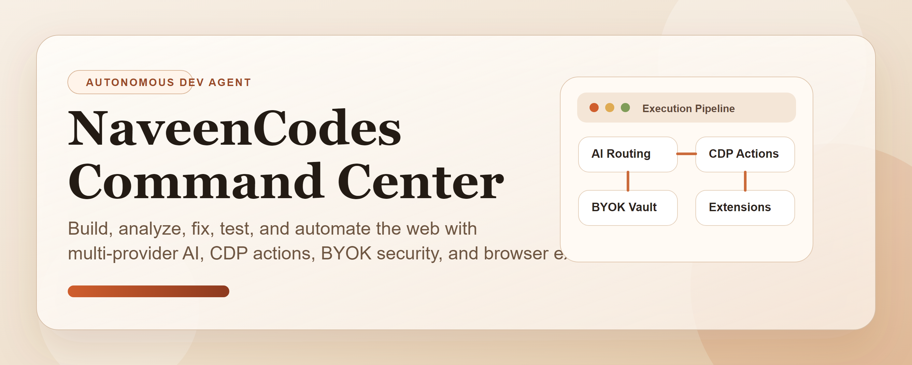
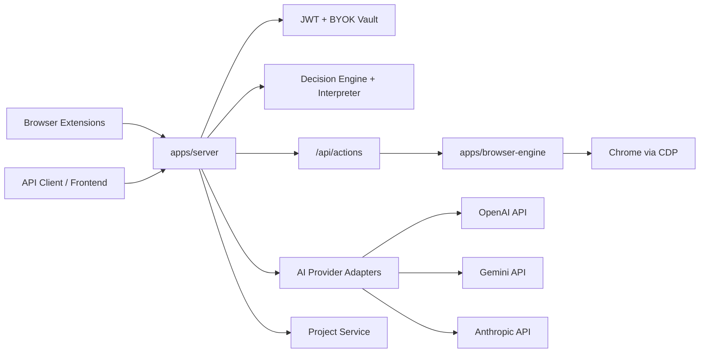

# NaveenCodes AI Agent



Production-ready repository for an AI-powered browser automation and developer agent system. NaveenCodes AI Agent combines a secured Node.js backend, a modular Chrome DevTools Protocol browser engine, an intelligence layer for autonomous routing, BYOK AI integrations for OpenAI, Gemini, and Claude, and a set of Manifest v3 browser extensions that can send page-aware commands directly to the backend.

## At a Glance

- Autonomous AI developer agent runtime with provider-aware routing
- OpenAI, Gemini, and Claude support with encrypted BYOK storage
- CDP browser automation with modular action handlers and extraction support
- Chrome extension surfaces for Gemini, OpenAI, Claude, and a universal client
- Compatibility-preserving API evolution with `/api/browser` and `/api/actions`

## CLI Quick Start

Run the full system with a single command:

```bash
npx naveencodes-ai-agent
```

Optional visible Chrome mode:

```bash
npx naveencodes-ai-agent --visible
```

The CLI will:

- install dependencies if `node_modules` is missing
- start or reuse the backend server
- start or reuse a Chrome session with remote debugging on port `9222`
- connect to Chrome via CDP
- print `AI Agent Ready 🚀` and `System Ready`

## Features

- Node.js + Express API server with `/api/auth`, `/api/chat`, `/api/analyze`, `/api/actions`, `/api/projects`, and compatibility support for `/api/browser`
- JWT authentication and protected routes
- BYOK provider-key vault with AES-256-GCM encryption at rest
- AI provider adapters for OpenAI, Google Gemini, and Claude
- Intelligence layer with `ai-client`, `decision-engine`, and `command-interpreter`
- CDP-based browser automation engine for navigation, clicks, typing, scroll, console/network capture, and screenshots
- Internal action modules for navigation, interaction, monitoring, and extraction
- Intent classification for `build`, `analyze`, `fix`, and `test`
- Autonomous loop support for `analyze -> fix -> re-test -> repeat`
- Project scaffolding endpoint for simple site generation
- Manifest v3 extensions for Gemini, OpenAI, Claude, and a universal client
- Structured command, execution, and error logs under `data/logs`
- Production-minded defaults with rate limiting, Helmet, validation, modular services, and compatibility-preserving route aliases

## Repository Structure

```text
/apps
  /server
    /src/intelligence
  /browser-engine
    /src/actions
/extensions
  /gemini-extension
  /openai-extension
  /claude-extension
  /universal-extension
/docs
/config
README.md
LICENSE
package.json
```

## Architecture



## Installation

1. Clone the repository.
2. Install dependencies:

   ```bash
   pnpm install
   ```

3. Copy environment variables:

   ```bash
   cp .env.example .env
   ```

4. Set secure values for `JWT_SECRET` and `ENCRYPTION_SECRET`.
5. Start the backend:

   ```bash
   pnpm dev
   ```

6. Optional: load any folder under `extensions/` as an unpacked Chrome extension.

## Usage

### Register and Login

```bash
curl -X POST http://127.0.0.1:4000/api/auth/register \
  -H "Content-Type: application/json" \
  -d '{"email":"owner@example.com","password":"StrongPass123!","name":"Owner"}'

curl -X POST http://127.0.0.1:4000/api/auth/login \
  -H "Content-Type: application/json" \
  -d '{"email":"owner@example.com","password":"StrongPass123!"}'
```

### Save a BYOK Provider Key

```bash
curl -X PUT http://127.0.0.1:4000/api/auth/provider-key \
  -H "Authorization: Bearer <token>" \
  -H "Content-Type: application/json" \
  -d '{"provider":"claude","apiKey":"sk-ant-..."}'
```

### Analyze a Command

```bash
curl -X POST http://127.0.0.1:4000/api/analyze \
  -H "Authorization: Bearer <token>" \
  -H "Content-Type: application/json" \
  -d '{"command":"test checkout flow on https://example.com"}'
```

### Execute Browser Actions

```bash
curl -X POST http://127.0.0.1:4000/api/actions \
  -H "Authorization: Bearer <token>" \
  -H "Content-Type: application/json" \
  -d '{
    "actions":[
      {"type":"openUrl","url":"https://example.com"},
      {"type":"scroll","y":900},
      {"type":"extractLinks"},
      {"type":"screenshot"}
    ]
  }'
```

### Run the Autonomous Loop

```bash
curl -X POST http://127.0.0.1:4000/api/analyze \
  -H "Authorization: Bearer <token>" \
  -H "Content-Type: application/json" \
  -d '{"command":"fix login flow on https://example.com","provider":"openai","autoExecute":true,"maxIterations":2}'
```

## API Summary

- `POST /api/auth/register`
- `POST /api/auth/login`
- `GET /api/auth/me`
- `PUT /api/auth/provider-key`
- `GET /api/auth/provider-key`
- `DELETE /api/auth/provider-key/:provider`
- `POST /api/chat`
- `POST /api/analyze`
- `POST /api/actions`
- `GET /api/projects`
- `POST /api/projects`
- `POST /api/browser`

`/api/browser` remains available for compatibility and is routed through the same action system.

## Example Commands

- `build a SaaS landing page with onboarding flow`
- `analyze this page for broken assets`
- `fix login issues on https://example.com`
- `test checkout flow and capture a screenshot`
- `analyze this page with Claude and summarize the next action`

## Screenshots

- Dashboard placeholder: `docs/screenshot-dashboard-placeholder.svg`
- Extension placeholder: `docs/screenshot-extension-placeholder.svg`
- Browser run placeholder: `docs/screenshot-browser-run-placeholder.svg`

## Security Notes

- API keys are encrypted before they are written to `data/secure/provider-keys.json`.
- JWT protects all sensitive endpoints.
- Zod validates request payloads.
- Helmet and rate limiting are enabled by default.
- Command, execution, and error logs are written to `data/logs`.

## Development

```bash
pnpm build
pnpm test
pnpm browser:doctor
```

See `docs/architecture.md` and `docs/api-examples.md` for more detail.

## Contribution Guide

1. Fork the repository.
2. Create a focused feature branch.
3. Keep modules small and validated with tests or reproducible API calls.
4. Document new endpoints, extension permissions, and environment variables.
5. Open a pull request with a clear summary, risk notes, and usage examples.

## License

MIT. See `LICENSE`.
